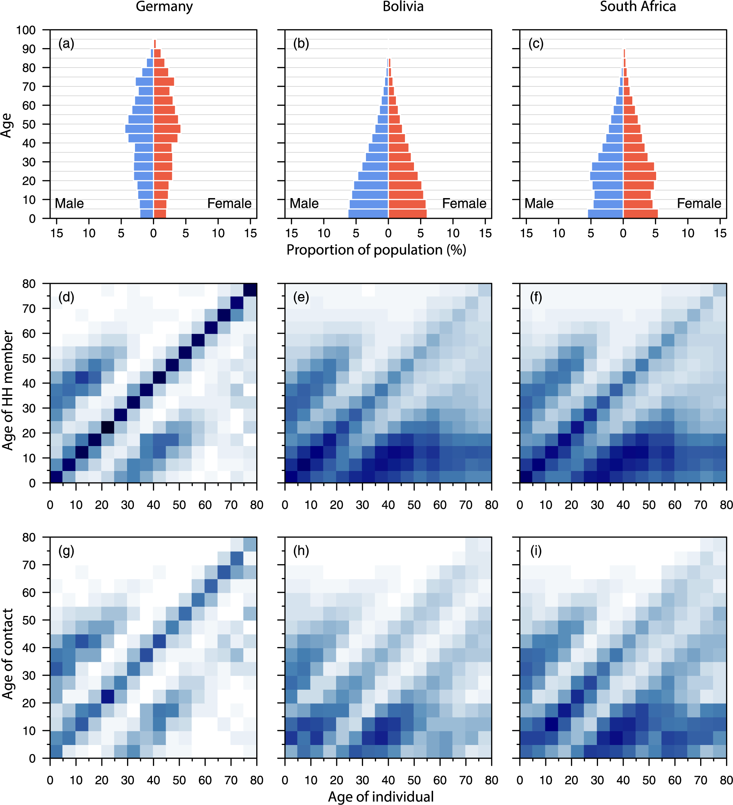
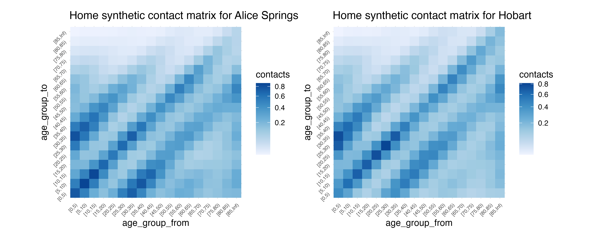

```{r setup, include=FALSE}
# options(htmltools.dir.version = FALSE, width = 120)
# NOTE TO SELF: The CSS styles were created in `create-njt-theme.R`
knitr::opts_chunk$set(
  fig.path = "figures/",
  cache.path = "cache/",
  fig.align = "center",
  fig.width = 13,
  fig.height = 6,
  fig.retina = 3,
  fig.show = "hold",
  external = TRUE,
  # dev = "svglite",
  # dev.args = list(bg = "transparent"),
  message = FALSE,
  warning = FALSE,
  cache = FALSE,
  echo = TRUE,
  autodep = TRUE
)
```

```{r library, include = FALSE, echo = FALSE}
library(tidyverse)
library(visdat)
library(naniar)
library(gganimate)
library(knitr)
library(ggrepel)
library(leaflet)
library(brolgar)
```


```{r read-tb, echo = FALSE, cache = TRUE}
tb <- read_csv(here::here("slides",
                          "data",
                          "TB_notifications_2018-03-18.csv.gz")) %>% 
  select(country, 
         iso3, 
         year, 
         new_sp_m04:new_sp_fu) %>%
  gather(key = stuff, 
         value = count, 
         new_sp_m04:new_sp_fu) %>%
  separate(col = stuff, 
           into = c("stuff1", 
                    "stuff2", 
                    "genderage")) %>%
  select(-stuff1, 
         -stuff2) %>%
  mutate(gender = str_sub(genderage, 1, 1), 
         age = str_sub(genderage, 2, length(genderage))) %>%
  select(-genderage) %>%
  filter(!(age %in% c("04", "014", "514", "u"))) %>%
  filter(year > 1996, 
         year < 2013)
  
tb_au <- tb %>% 
  filter(country == "Australia")  %>%
mutate(age =
  case_when(age == "1524" ~ "15-24",
            age == "2534" ~ "25-34",
            age == "3544" ~ "35-44",
            age == "4554" ~ "45-54",
            age == "5564" ~ "55-64",
            age == "65" ~ "65+"))
```


```{r helpers, include=FALSE}
theme_set(
  theme_grey(base_size = 16) +
  theme(
    legend.position = "bottom",
    plot.background = element_rect(fill = "transparent"),
    legend.background = element_rect(fill = "transparent")
  )
)

# **ni**ck's **pa**lette
nipa <- list(red = "#c03018",
             orange = "#f0a800",
             green = "#609048",
             purple = "#484878",
             light_purple = "#A3A3BB",
             light_green = "#AFC7A3",
             light_orange = "#F7D37F",
             light_red = "#DF978B",
             pale_purple = "#ECECF1",
             pale_green = "#D7E3D1",
             pale_orange = "#FBE9BF",
             pale_red = "#EFCBC4")


as_table <- function(...) knitr::kable(..., format='html', digits = 3)
```

---
# My journey into the RSE world

2008-2012:  Undergraduate + honours in Psychology

--

2013 - 2017: PhD Statistics

- Exploratory Data Analysis (EDA)
- Bayesian Statistics
- Geospatial statistics / Optimal facility placement

--

2018 - 2020: Research Fellow / Lecturer at Monash

  - Design and improve tools for (exploratory) data analysis
  - Teach introduction to data analysis (ETC1010)

---
    
# EDA: Exploratory Data Analysis

.large[
> ...EDA is an approach to analyzing data sets to summarize their main characteristics, often with visual methods. (Wikipedia)

John Tukey, Frederick Mosteller, Bill Cleveland, Dianne Cook, Heike Hoffman, Rob Hyndman, Hadley Wickham
]

---

# EDA: Why it's worth it

```{r dino-saurus, echo = FALSE}
include_graphics("gifs/dino-saurus.gif")
```

-- From ["Same Stats, Different Graphs: Generating Datasets with Varied Appearance and Identical Statistics through Simulated Annealing"](https://www.autodeskresearch.com/publications/samestats)

---

## `visdat::vis_dat(airquality)`

```{r show-visdat, fig.height = 3.5, fig.width = 8, out.width = "150%", echo = FALSE}
vis_dat(airquality)
```


---

## `naniar::geom_miss_point()`

```{r gg-miss-point, fig.height = 3.5, fig.width = 8, out.width = "150%", echo = FALSE}
ggplot(airquality,
       aes(x = Ozone,
           y = Solar.R)) + 
  geom_miss_point()
```

---

## `naniar::gg_miss_var(airquality)`

```{r gg-miss-var, fig.height = 3.5, fig.width = 8, out.width = "150%", echo = FALSE}
gg_miss_var(airquality)
```

---

## `naniar::gg_miss_upset(riskfactors)`

```{r gg-miss-upset, fig.height = 3.5, fig.width = 8, out.width = "150%", echo = FALSE}
gg_miss_upset(riskfactors)
```


---

## `brolgar` - take spaghetti

```{r gg-brolgar, echo = FALSE}
ggplot(heights,
       aes(x = year,
           y = height_cm,
           group = country)) + 
  geom_line()
```

---

## `brolgar` - sample spaghetti


```{r gg-brolgar-sample, echo = FALSE}
ggplot(heights,
       aes(x = year,
           y = height_cm,
           group = country)) + 
  geom_line() + 
  facet_sample()
```


---

## `brolgar` - spread spaghetti


```{r gg-brolgar-spread, echo = FALSE}
ggplot(heights,
       aes(x = year,
           y = height_cm,
           group = country)) + 
  geom_line() + 
  facet_strata(along = -year)
```

---
# Now

.large[

Research Software Engineer

Working at [Telethon Kids Institute](https://www.telethonkids.org.au/)

With the [Malaria Atlas Project](https://malariaatlas.org/)

]

---
# Define: Research Software Engineer

> A Research Software Engineer (RSE) combines professional software engineering expertise with an intimate understanding of research.

-- (from https://society-rse.org/about/)

--

> The Society of Research Software Engineering was founded on the belief that a world which relies on software must recognise the people who develop it.


---
## Research software engineer vs Software Engineer

**Researcher**

- Create statistical model of malaria for given region

--

**Software engineer**: 

- Take existing code base, and productionise in containers to run on the web

--

**Research software engineer**: 

- Identify abstractions, create software that lets researchers write code focussing on the models 

---
# What sorts of things does an RSE do?

.large[
- Create software to **solve research problems**
- Develop tools that **abstract the right components** to facilitate research
- Help researchers to **find and learn** good tools
- Support researchers with (computational) reproducibility
]

(adapted from Heidi Seibold's [UseR2021 Keynote talk](https://docs.google.com/presentation/d/1XQc2U2X8hiK43UzUi9IwvsvULxhVy0WzWSa_Kt4ZJv4/view#slide=id.gdbfb32d486_0_448))


---
class: inverse, middle, center
# What do I do as an RSE?

---

## [{greta}: scalable statistical inference](https://greta-stats.org/)

```{r show-greta, echo = FALSE}

```


--

Created by Professor Nick Golding

[Air example](https://greta-stats.org/articles/example_models.html#bugs-models)

--

My primary role: Maintain and improve code base of  greta

--

What does that look like?

- 11,177 lines of code
- 1,535 tests
- ~705 functions


---

## [{greta}: scalable statistical inference](https://greta-stats.org/)

How do you get to grips with a new code base?

--

- Sort alphabetically, read through every line of code (really)
- Keep a document of things I note that could be improved
- ...16 pages of notes later, rearrange and organise into tasks/groups

---

## [{greta}: scalable statistical inference](https://greta-stats.org/)

- Some of the initial work:

 - Transfer package builds over to GitHub Actions
 - Develop helper functions for easy installation of TensorFlow + Python
 - Convert roxygen to use markdown
 - Implement tidyverse style
 - Review error messages
 - use glue over paste/sprintf to construct messages
 - Various user side improvements for messages and loading of tensorflow
 - Use snapshot testing to better capture messages

---

##  Examples of daily tasks: with {greta}

Python no longer detected?
  - Latest RStudio doesn't detect Python
  - File issue with RStudio
  - Identify fix with an environment variable

---

##  Examples of daily tasks: with {greta}

RStudio Tensorflow package has updated
  - `dim()` now returns vector not list
  - Completely breaks greta
  - (This happens just as we are teaching a course)
  - Solution: have two versions of greta, one docker container, one local
  - Browse into errored parts of the code in each version

---

# Example: Malaria modelling

```{r malaria-eg, eval = FALSE}
model <- inlabru::bru(
formula = pr ~ avg_lower_age + Intercept + 
  who_region(month_num, #<<
             model = "ar1", 
             group = .who_region_id, #<<
             constr = FALSE) + 
  who_subregion(month_num,  #<<
                model = "ar1", 
                group = .who_subregion_id, #<<
                constr = FALSE) + 
  country(month_num, #<<
          model = "ar1", 
          group = .country_id, #<<
          constr = FALSE),
    family = "gaussian",
    data = malaria_africa_ts,
    options = list(control.compute = list(config = TRUE),
                   control.predictor = list(compute = TRUE, link = 1))
    )
```

---

# Example: Malaria modelling


```{r show-code, echo = TRUE, eval = FALSE}
cleaned_data <- data %>%
    as_tibble() %>%
    group_by(who_region) %>%
    transmute(.who_region_id = cur_group_id()) %>% #<<
    ungroup(who_region) %>%
    select(-who_region) %>% 
    group_by(who_subregion) %>%
    transmute(.who_subregion_id = cur_group_id()) %>% #<<
    ungroup(who_subregion) %>%
    select(-who_subregion) %>% 
    group_by(country) %>%
    transmute(.country_id = cur_group_id()) %>% #<<
    ungroup(country) %>%
    select(-country) 
```


---

# Example: Malaria modelling

[`yahtsee` (Yet Another Hierarchical Time Series Extension + Expansion)](https://github.com/njtierney/yahtsee)

```{r show-yahtsee, eval = FALSE, echo = TRUE}
m <- fit_hts(
  formula = pr ~ avg_lower_age + 
  hts(who_region, #<<
      who_subregion, #<<
      country), #<<
  .data = malaria_africa_ts,
  family = "gaussian"
)
```

---
# Contact matrices - [Prem et al](https://journals.plos.org/ploscompbiol/article?id=10.1371/journal.pcbi.1005697#sec020)

```{r show-prem-matrix, echo = FALSE, out.width = "40%"}

```


---

# Contact matrices

.pull-left[
```{r show-prem-matrix-data, echo = FALSE}
knitr::include_graphics("imgs/prem-supp-data.png")
```
]

.pull-right[
```{r show-prem-matrix-excel, echo = FALSE}
knitr::include_graphics("imgs/prem-excel-data.png")
```

]

---
# Contact matrices

```{r show-prem-matrix-excel-data-oz, echo = FALSE, out.width = "75%"}
knitr::include_graphics("imgs/prem-matrix-excel-australia.png")
```

---
# Contact matrices

```{r show-conmat-matric, echo = FALSE}

```

---

# Contact matrices

- `conmat` (name in progress) package facilitates contact matrix analysis
- Nick Golding contributed statistical modelling
- I implemented package design, infrastructure, tests, documentation
- absolutely critical in recent national covid19 modelling to prime ministers cabinet
- package available on [github](https://github.com/njtierney/conmat)

---

# Developing robust pipelines for rapid analysis

- Working with "Doherty Modelling Group" for Prime Ministers Cabinet
- Ensure codebase stays stable with multiple contributors
- Ensure order of operations stays consistent/easy to comprehend with large amounts of code being written (about 8000 lines of code and 260 functions written from September - October)

--

- Use {targets}, {fnmate}, and {capsule} to capture pipline workflow, rapidly write functions, and lock in package versions
- Example: https://github.com/njtierney/ttiq-simulation

---

# Thanks

.large.pull-left[
- Nick Golding
- Miles McBain
]

.large.pull-right[
- Di Cook
- Rob Hyndman
]

---

# Colophon

.large[
- Slides made using [xaringan](https://github.com/yihui/xaringan)
- Extended with [xaringanthemer](https://github.com/gadenbuie/xaringanthemer)
- Colours taken + modified from [lorikeet theme from ochRe](https://github.com/ropenscilabs/ochRe)
- Header font is **Josefin Sans**
- Body text font is **Montserrat**
- Code font is **Fira Mono**
- template available: [njtierney/njt-talks](github.com/njtierney/njt-talks)
]


---

.vhuge[
**End.**
]
